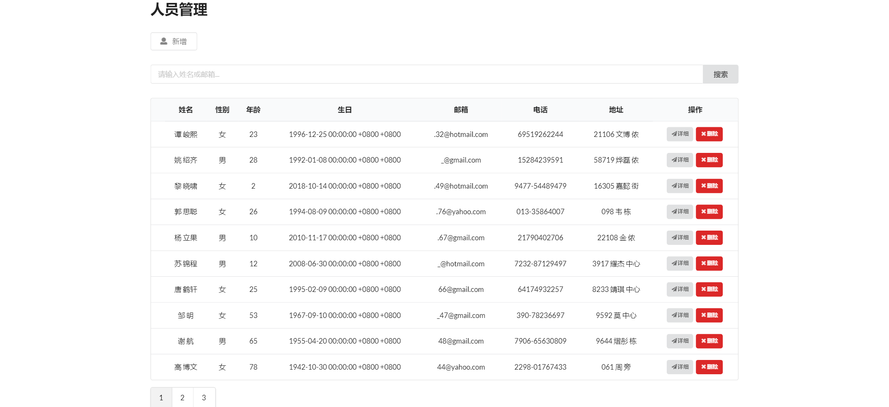
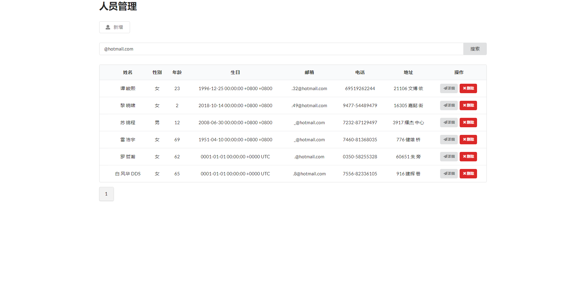
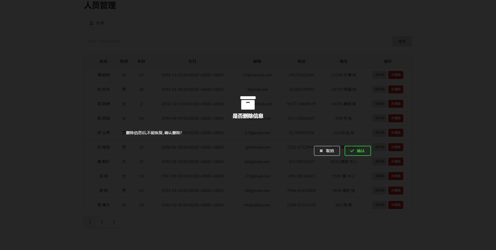

# 人员管理系统

Gin+Sqlite 实现的人员管理系统

## 目的

1. 熟悉Go的语法
2. 熟悉Gin框架的语法

## 截图

## 使用的框架或脚本

- Gin v1.5.0
- Gorm v1.9.12
- Ini v1.52.0
- jQuery 3.3.1
- Semantic-ui 2.4.1
- faker.js 

## Todo-List
1. [ ] swagger集成
2. [x] cron定时添加

